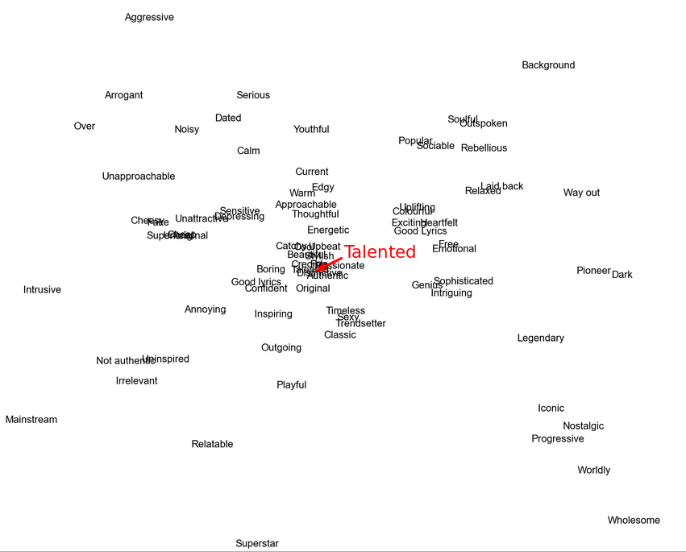
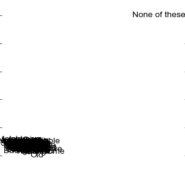
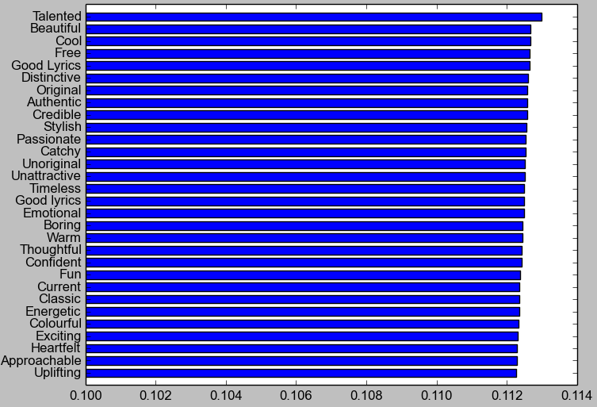
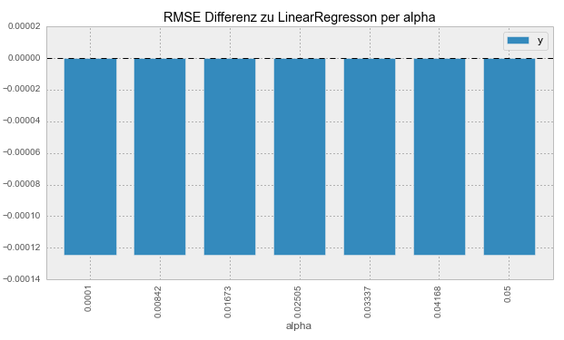
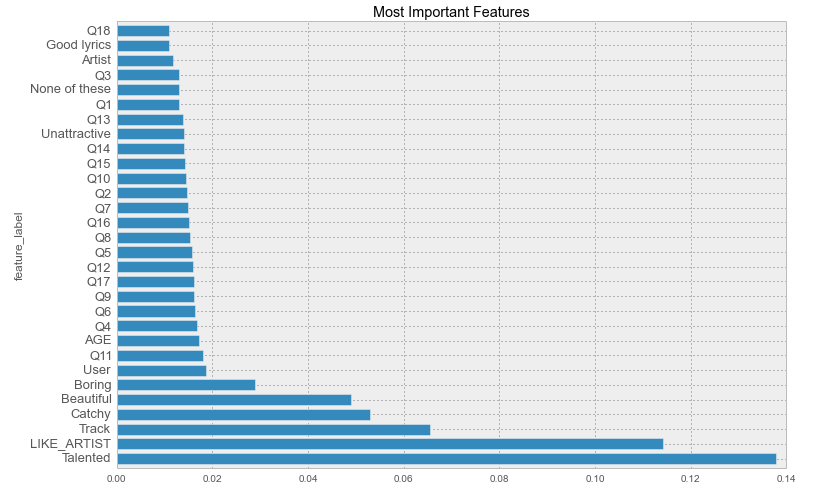
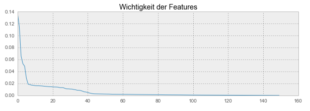
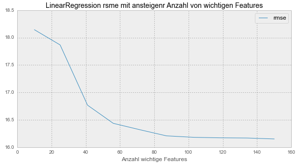
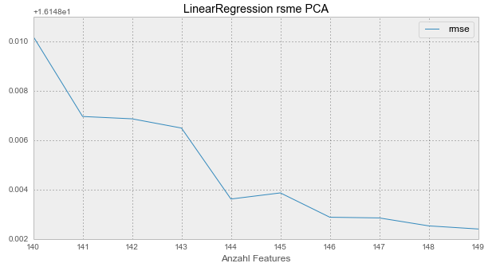

% Projekt-Bericht und Dokumentation im Kurs `Ausgewählte Kapitel sozialer Webtechnologien` mit dem Thema `Machine Learning`, SoSe15
% Simon Arnold; Lukas Hodel
% 28. Juli 2015

# Einleitung

Der EMI Music Data Science Hackathon war ein vom 21. Juli 2012 bis zum 22. Juli 2012 laufender Wettbewerb auf kaggle.com der zur EMI Music Group gehörenden EMI Insight. Grundlage des Wettbewerbs war ein Datensatz der EMI Insight Marktforschung, der insgesamt eine Million Erhebungen und Aussagen über Musikvorlieben, Hörgewohnheiten und weitere Daten, wie beispielsweise Wohnort, Alter und Arbeitssituation beinhaltet. Eine Teilmenge dieses Datensatzes wurde für den Hackathon zur Verfügung gestellt um die Frage zu beantworten, inwieweit sich anhand dieser statistischen Daten voraussagen lässt, wie positiv oder negativ eine Person ein bestimmtes neues Lied bewerten wird.

Ein weiterer Augenmerk des Hackathons lag auf der Visualisierung der vorhandenen Daten. Da die Umfragen der EMI Insight auch einige Informationen über die Lebensverhältnisse der befragten Personen liefern, liessen sich aus dem Datensatz auch interessante Schlussfolgerungen über beispielsweise die Musikvorlieben unterschiedlicher Altersgruppen herleiten. Diese konnten visualisiert und anschließend von anderen Nutzern des Hackthons bewertet werden. [@kaggle-emi]

## Verwendete Technologien

Die explorative Datenanalyse, das Preprocessing sowie das Erstellen von Voraussagemodelle werden mittels der Programmiersprache _Python_ [@python] in der Version _2.7.6_ gemacht. Dabei werden die Skripte mit Hilfe des _ipython notebook_ [@ipython-notebook] in der Version _3.2_ erstellt.

Die _explorative Datenanalyse_ wird ausschliesslich mit der Python Bibliothek _Pandas_ [@pandas] durchgeführt. Einzig für die Kookkurrenten-Analyse wird die Bibliothek _Networkx_ [@networkx] für die _PageRank_ [@page-rank] Berechnung und deren Visualisierung verwendet. Für das erstellen von Grafiken wird von beiden Bibliotheken die Bibliothek _matplotlib_ [@matplotlib] verwendet.

Das Preprocessing und das Erstellen der Voraussagemodelle werden mit Hilfe der Bibliothek _scikit-learn_ [@scikit-learn] durchgeführt.

Sowol _scikit-learn_ [@scikit-learn] als auch _pandas_ [@pandas] verwenden die Bibliothek _numpy_ [@numpy].

## Der Datensatz

Der zur Verfügung gestellte Datensatz beinhaltet insgesamt fünf Dateien im `csv` Format:

### train.csv

Künstler-Id, Track-Id und User-Id zusammen mit der abgegebenen Bewertung des Befragten zu diesem Lied auf einer Skala von 1 bis 100, sowie das Datum, an dem die Person befragt wurde.

### users.csv

Informationen über die Befragten. Dazu gehören die User-Id, das Geschlecht des Befragten, das Alter, die Arbeitssituation und die Region des Wohnortes in Großbritannien.    

Außerdem Angaben der Personen, wieviele Stunden sie Musik täglich aktiv (beispielsweise mithilfe eines IPods) und passiv (beispielsweise im Radio) hören. Die Datei enthält weiterhin Aussagen der Befragten, welche Rolle Musik in ihrem Leben spielt, mit einer Auswahl zwischen den Antwortmöglichkeiten:

- Music is important to me but not necessarily more important
- Music means a lot to me and is a passion of mine
- I like music but it does not feature heavily in my life
- Music is important to me but not necessarily more important than other hobbies or interests
- Music is no longer as important as it used to be to me
- Music has no particular interest for me

und Antworten auf einer Skala von 1 bis 100 (mit 1 - _Stimme gar nicht zu_ und 100 - _Stimme voll zu_) auf folgende Fragen:

- I enjoy actively searching for and discovering music that I have never heard before
- I find it easy to find new music
- I am constantly interested in and looking for more music
- I would like to buy new music but I don’t know what to buy
- I used to know where to find music
- I am not willing to pay for music
- I enjoy music primarily from going out to dance
- Music for me is all about nightlife and going out
- I am out of touch with new music
- My music collection is a source of pride
- Pop music is fun
- Pop music helps me to escape
- I want a multi media experience at my fingertips wherever I go
- I love technology
- People often ask my advice on music - what to listen to
- I would be willing to pay for the opportunity to buy new music pre-release
- I find seeing a new artist / band on TV a useful way of discovering new music
- I like to be at the cutting edge of new music
- I like to know about music before other people

### words.csv

Künstler-Id, User-Id und Aussagen der Befragten darüber, ob sie den gerade gehörten Künstler kennen, Werke von ihm besitzen, wie sie ihn auf einer Skala von 1 bis 100 bewerten und die Wahl der Befragten von 82 möglichen Worten, mit denen sie den gerade gehörten Künstler beschreiben sollten.

### UserKey.csv

Spaltenüberschriften für die Datei `users.csv`

### test.csv

Der Datensatz, der zur Bewertung verwendet wird. Dieser ist wie die Datei `train.csv` aufgebaut, enthält allerdings keine Bewertungen der Lieder. Diese sollen vorhergesagt werden.

## Ziel des Hackathons

Ziel des Hackathons und auch unsere Zielsetzung war es, einen Algorithmus zu entwickeln, der die Bewertung eines Nutzers für ein gehörtes Lied auf einer Skala von 1 bis 100 vorhersagen kann.
Dazu soll der Algorithmus die demographischen Daten des Nutzers, die von ihm abgegebenen Bewertungen zu anderen Liedern und Künstlern, die verwendeten Wörter um gehörte Künstler zu beschreiben, sowie die Musikvorlieben des Befragten in Betracht ziehen.

Bewertet wurde dabei mithilfe des Testdatensatzes, zu dem die vermutlichen Bewertungen vorhergesagt werden sollten. Der _Score_ war der _Root Mean Squared Error_ [@kaggle-rmse] zwischen vorhergesagten und tatsächlichen Bewertungen der in der Datei `test.csv` aufgeführten Lieder. Leider standen uns die Originaldaten, also die Testdatei __mit__ tatsächlichen Bewertungen nicht zur Verfügung, sodass wir unseren _Score_ nicht auf den gleichen Daten wie die Teilnehmer des Hackathons berechnen konnten.

Neben der eigentlichen Vorhersage der Bewertungen sollten auch Visualisierungen der demographischen Daten und der Antworten auf die in der Umfrage gestellten Fragen der Nutzer entstehen.  

# Explorative Analyse der Daten

Uns standen insgesamt 188691 Bewertungen der Nutzer zur Verfügung, wobei jeder Nutzer mehrere Titel bewertete und jeder Titel auch von mehreren Benutzern bewertet wurde. Insgesamt zeigte sich, dass Nutzer eher Bewertungen in Zehnerschritten bevorzugten, insbesondere die Werte 10, 30, 50, 70 und 90.

\

Die Geschlechterverteilung war dabei annähernd gleich.

\

Das Alter der Befragten reichte von 13 bis 94 Jahre. Die größte Bevölkerungsgruppe stellte die Gruppe der 20-25 Jährigen. 

\

Auf die Frage, welche Rolle Musik im Leben der Person spiele, antworteten eine große Mehrheit, dass Musik eine sehr wichtige oder zumindest wichtige Rolle spiele. 

\

Und auch die angegebene Zeit, die Teilnehmer der Umfrage täglich aktiv und passiv mit dem Hören von Musik verbringen, bewegte sich eher im niedrigen Bereich. Es ist zu beachten, dass Angaben von "Mehr als 16 Stunden" zu dem Wert für 16 Stunden hinzugezählt wurden.

\

Dabei zeigte sich, dass das jüngere Teilnehmer eindeutig mehr Zeit mit dem Hören von Musik verbrachten als ältere. Dies deckte sich mit dem Interesse an Musik der Teilnehmer, das mit zunehmendem Alter abnahm. Um dies in einen numerischen Wert zu bringen, wurde jeder möglichen Aussage zur Wichtigkeit von Musik im Leben des Teilnehmers ein Wert zugewiesen:

```python
  # Transform the music interest into a usable value
  def music_interest_transform(answer):
      return {
          'Music means a lot to me and is a passion of mine' : 1,
          'Music is important to me but not necessarily more important than other hobbies or interests' : 0.75,
          'Music is important to me but not necessarily more important': 0.75,
          'I like music but it does not feature heavily in my life': 0.5,
          'Music is no longer as important as it used to be to me': 0.25,
          'Music has no particular interest for me': 0
      }.get(answer, np.nan)
      
  data.loc[:, 'MUSIC'] = data['MUSIC'].apply(music_interest_transform)
```

\

\

__Hinweis__: Im letzten Plot wurden Altersgruppen von Teilnehmern, die weniger als 100 Personen beinhalteten herausgenommen, da diese durch ihre geringe Zahl keine aussagekräftigen Werte lieferten.

## Demographische Daten und ihr Zusammenhang mit der abgegebenen Bewertung

In Bezug nun zur Bewertung, die Teilnehmer den Songs bzw Künstlern gaben, schienen einige demographische Daten eine wichtige Rolle zu spielen. So gaben Teilnehmer, die eine feste Stelle hatten durchschnittlich am meisten Punkte, Teilnehmer die bereits pensioniert waren am wenigsten.

\

Das Alter hingegen gab wenig Hinweis auf die abgegebenen Bewerungen des Teilnehmers. Lediglich Teilnehmer über 80 Jahre schienen deutlich schlechter zu bewerten.

\

Im Gegensatz dazu spielte das angegebene Interesse des Teilnehmers an Musik eine große Rolle. Niedrige Bewertungen wurden generell eher von Menschen abgegeben, die auch angaben weniger Interesse an Musik zu haben. Die höchsten Bewertungen wurden von Menschen mit großem Interesse an Musik gegeben.

\

## Kookkurrents-Analyse der Worte

Die Artisten wurden von jedem Benutzer mit mehreren von 82 gegebenen Wörtern oder dem Tag "None of these" bewertet.
Wenn man nun die Tags pro Artist als "Satz" interpretiert, kann man aus den Tags eine Kookkurrenzliste ableiten.

Die Kookkurrenzliste is ein verschachtelter Hash, bzw. ein `dict`. Der `key` vom Eltern `dict` ist ein Wort. Der `key` vom Kinds `dict` ist das kookkurrierende Wort. Dieses wiederum hat als `value` die frequenz, wie oft es mit dem Eltern-Wort vorkommt.

__Hier der Beginn der von uns erstellten Liste:__

```json
  {
      'Aggressive': {
          'Annoying': 337,
          'Approachable': 145,
          'Arrogant': 1539,
          'Authentic': 515,
          ...
       },
       'Annoying': {
          'Aggressive': 337,
          'Approachable': 18,
          'Arrogant': 372,
          'Authentic': 50,
          ...
       },
       ...
  }
```

### Berechnen der Signifikanz

Nun kann durch die Häufigkeit des gemeinsamem Auftretens die Signifikanz eines Wortes zu einem anderen berechnet werden.
In einfachster Form ist dies deren gemeinsames Auftreten selbst.
Nun gibt es noch komplexere Formen der Signifikanzberechnungen wie der DICE-Koeffizient, die Loglikelihood und der Poisson-Mass. Diese sind alle gerichtete Signifikanzen. Das heißt Wort A ist zu Wort B gleich signifikant wie Wort B zu Wort A. Das Poisson-Mass hat die besten Ergebnisse geliefert, deswegen wird mit diesem weiter gearbeitet. Diese Sigifikanz kann num mit Hilfe der python library networkx [@networkx] und der Metode `draw_networkx` folgende Grafik erstellt werden. Für das Layout des Graphen wird das `spring_layout` verwendet, welches eine Implementation des "Fruchterman-Reingold force-directed Algorithmus" [@force-directed-graph] ist.

\

Aus dieser Grafik wurden die Tags "None of These" und "Old" entfernt. Dies da dies die zwei Tags mit der kleinsten signifikanz sind. Wenn diese dabei sind kann man die Unterschiede der anderen Tags kaum mehr sehen. Auch nicht gut zu sehen ist (deswegen rot erläutert) dass sich "Talented" ziemlich genau in der Mitte des Graphen befindet. Talented ist, wie später errechnet wird, das signifikanteste Wort.

\

Hier kann man sehr schön erkennen, dass "Non of these" nie mit einem anderen Wort vorkommt. Was ja auch sonst keinen Sinn machen würde.

### Berechnung der Worte mit der höchsten Signifikanz mittels PageRank [@page-rank]

Wenn man die Kookkurrenten und deren Signifikanz analog zu Webseiten, welche durch Links auf einander zeigen interpretiert, kann angenommen werden, dass auf die Kookkurrenzen eben so der PageRank-Algorithmus angewendet werden kann. Durch den PageRank-Algorithmus kann herausgefunden werden, welche Kookkurrenten, also Worte am meisten mit anderen Worten zusammen auftreten und so zusagen einen höheren Stellenwert besitzen.

Um den PageRank zu berechnen verwenden wir die Python-Bibliothek _networkx_ [@networkx]. Diese erlaubt es einen Graphen zu generieren, und bietet die Berechnung von PageRank an. 

__Die 30 signifikantesten Kookkurrenten__

\

Die signifikantesten Terme werden in der "Tag Cloud" eher in der Mitte dargestellt.

Interessant ist hier, dass ein Grossteil der signifikantesten Kookkurrenten ebenfalls später vom RandomForestRegressor als "important Features" angegeben werden. 

### Weiterführende Gedanken zu der Kookkurrentenanalyse

Nun könnte man diese Terme noch Klustern um neue Gruppierungen zu erhalten. Dann könnte man die 83 Suchterme auch in kleinere Gruppen runterbrechen und so die Featuremenge verkleinern, ohne dass ganze Terme gestrichen werden.
In der Arbeit wurde experimentiert, dass nur die wichtigsten Worte verwendet werden. Dies hat zwar zum Effekt, dass die Vorhersagen mit weniger Features trotzdem noch gut sind. Besser wurde es durch die Featuresreduktion jedoch nicht.

# Predicting

## Preprocessing

### Analyse der Konsistenz in den CSV Dateien

Wie unten ab zu lesen ist, gibt es Inkonsistenzen bei den User-Daten. In allen csv Dateien gibt es eine unterschiedliche Anzahl von eindeutigen Users. Wir werden beim Zusammenführen dieser Datein einen _inner join_ anwenden, wodurch nur noch Datensätze übrig bleiben welche Konsistent sind. Leider können wir die User nicht über einen Mittelwert auffüllen.

    Unique Artists in train Frame 50
    Unique Artists in words Frame 50
    Unique Users in train Frame 49479
    Unique Users in words Frame 50928
    Unique Users in user Frame 48645
    
### Erstellen von Dummy-Werte/Spalten für nicht-nummerische Spalten

Die Spalten `GENDER`, `REGION`, `WORKING` und `MUSIC` der Datei users.csv und die Spalten `HEARD_OF` und `OWN_ARTIST_MUSIC` der Datei words.cvs sind mit nicht-nummerischen Werten Gefüllt. Diese Werte müssen in nummerische Werte umgewandelt werden. Dafür werden sogenannte Dummy Werte erstellt. Dies kann mit Hilfe der Pandasfunktion `pd.get_dummies`  gemacht werden. Durch `pd.concat` werden die neu erstellten Spalten wieder mit dem pandas Dataframe zusammengeführt (konkatiniert).

```python
userFrameDummy = pd.concat([userFrame,
    pd.get_dummies(userFrame['GENDER'], prefix="sex"),
    pd.get_dummies(userFrame['REGION'], prefix="region"),
    pd.get_dummies(userFrame['WORKING'], prefix="work"),
    pd.get_dummies(userFrame['MUSIC'], prefix="music")], 
   axis=1)

wordsFrameDummy = pd.concat([wordsFrame,
   pd.get_dummies(wordsFrame['HEARD_OF'], prefix='heard'),
   pd.get_dummies(wordsFrame['OWN_ARTIST_MUSIC'], prefix='own')],
  axis=1)
```

Danach müssen die Originalspalten entfernt werden da diese Werte ungültig, rsp nicht verarbeitet werden können.

### Weitere Werteanpassungen

__LIST_OWN und LIST_BACK__

Die Felder `LIST_OWN` und `LIST BACK` beinhalten Zahlen, welche sowohl in numerischer Form, als auch in verbaler Form ausgedrückt werden. Um nur numerische Werte zu erhalten, werden diese mit einer speziellen Funktion transformiert.

```python
def hourTransform(val):
    if val in ['Less than an hour', '0', '0 Hours']:
        return 0
    if val in ['More than 16 hours', '16+ hours']:
        return 18
    for i in xrange(24):
        if val in [str(i) + ' hour', str(i) + ' hours', str(i)]:
            return i
    return None
```

Diese Funktion wird dann auf die Spalte angewandt:

```python
userFrameDummy['LIST_OWN'] = userFrameDummy['LIST_OWN'].apply(hourTransform)
```

### Zusammenführen der Pandas Dataframes 

Nun werden die pandas Dataframes der Wörter, Tracks und Users zusammengeführt. Dabei wird explizit ein _Inner Join_ verwedet, damit die inkonsistenten Daten wegfallen. Zu beachten ist, dass die Userspalte in der Datei train.csv den Namen `RESPID` hat, in den anderen zwei Dateien jedoch `User` heisst.

```python
X_all = pd.merge(trainFrame, userFrameDummy, how='inner', 
                 left_on='User', right_on='RESPID').drop('RESPID',1)
X_all = pd.merge(X_all, wordsFrameDummy, how='inner', on=['Artist', 'User'])
```

__X_all__ ist nun ein pandas Dataframe, welches alle Features und auch die Ratings beinhaltet.

### Trennen der Features mit dem Target

Das zu vorhersagende Feld (target) ist _Rating_, deswegen wird nun diese Spalte aus `X_all` entfernt und in `y_all` hinzugefügt.

```python
y_all = X_all['Rating']
X_all = X_all.drop('Rating',1)
```
### Trennen der Trainingsdaten in Train -und Testdaten

Das Training sollte nicht auf den Testdaten passieren. Damit wir sicher nicht eine Abhängigkeit schaffen, werden die Test- und Trainingsdaten getrennt, bevor die NaN-Werte aufgefüllt werden. Dafür verwenden wir die von `sklearn.cross_validation` gestellte Funktion `train_test_split`. Dabei werden 20% der Daten in Testdaten getrennt. Die Daten werden zufällig heraus gepickt. Diese Zufälligkeitsverfahren wurde gewählt, um zu verhindern, dass User ausschließlich im Test oder im Trainingsset befinden.

```python
from sklearn import cross_validation
X_train, X_test, y_train, y_test = cross_validation.train_test_split(
    X_all, y_all, test_size=0.20, random_state=2)
```

## Training

### Regression/Klassifikation

Da sich zwei leicht unterschiedliche Bewertungen, beispielsweise 99 und 100, einander sehr ähnlich sind, handelt es sich hierbei um ein Regressionsproblem und nicht um eine Klassifikation. Rein theoretisch könnte man die Ratings in 100 Klassen aufteilen, somit wäre 99 und 100 jedoch komplet anders.

### Base LinearRegression

Zum Verglich der verschiedenen Modelle wurde zunächst die lineare Regression  als Grundlage gewählt. Dabei wurde folgendermaßen vorgegangen:

- Die Trainingsdaten werden nochmals durch Crossvalidation in 3 Teile gesplittet.
- Es wird sklearn.pipeline verwendet, um die Reihenfolge der Lernschritte zu automatisieren.
- Durch preprocessing.Imputer werden die NaN Felder mit dem Mittelwert gefüllt.
- Durch proprocessing.StandardScalar werden die Features skaliert.
- der `cross_validation.cross_val_score` berechnet den `mean_squared_error` der corssvalidation.

Es ist uns aufgefallen, dass die Methode `cross_val_score` einen negativen `mean_squared_error` zurück gibt. Näheres kann im dafür erstellen Github issue [@github-sklearn-mse-issue] nachgelesen werden. Wir konnten das Problem lösen, indem wir einfach das Resultat wieder mit -1 multiplizierten.

Um den `root_mean_squared_error` (rmse), welche von Kaggle [@kaggle-rmse] vorgeschrieben wird, zu erhalten, haben wir die Wurzel manuell gezogen.

```python
from sklearn.linear_model import LinearRegression
from sklearn.pipeline import make_pipeline
from sklearn import metrics
from sklearn import cross_validation
from sklearn import preprocessing

model = LinearRegression()

cv = cross_validation.ShuffleSplit(X_train.shape[0], n_iter=3,
    test_size=0.3, random_state=0)

mean_preprocessor = preprocessing.Imputer(strategy="mean", axis=0)
scaler_preprocessor = preprocessing.StandardScaler()
clf = make_pipeline(mean_preprocessor, scaler_preprocessor, model)
scores = cross_validation.cross_val_score(clf, X_train, y_train, scoring="mean_squared_error", cv=cv)
(scores.mean() * -1) **0.5

# >> durchschnittliche rmse => 16.15075547663826
```

Mit diesem Model konnten wir auf Kaggle einen guten Mittelfeld Platz ergattern.

### RidgeRegressor [@sklearn-ridge]

Der RidgeRegressor ist eine Erweiterung des LinearRegressor durch Regularisierung. Nun ist es möglich einen Parameter `alpha` mit zu geben. Je grösser dieser Wert gewählt wird, desto mehr wird versucht die Dimension der Polynomfunktion - da wir mehrere Features haben - zu reduzieren. Es ist also eine Methode um Overfitting zu verhindern.

\

Wie man an der Grafik sehen kann, ändern sich die Werte pro alpha minimalst. Und zusätzlich sind sie gegenübergestellt des rsme von __16.15075547663826__ der einfachen LinearenRegression alle schlechter.

### LassoRegressor [@sklearn-lasso]

Eine weitere Erweiterung der LinearenRegression ist der LassoRegressor. Dieser versucht ebenfalls wie der RidgeRegressor eine gewisse Regularisierung zu erreichen. Genauer versucht der LassoRegressor wichtige Features zu finden und nur diese zu verwenden. Der LassoRegressor hat jedoch auch nur schlechtere Ergebnisse geliefert, als der normale LinearRegressor. 

Es wurden alphas zwischen 0.001 und 0.5 gewählt. Dabei hat die der rsme nicht verändert bei __16.150947926890396__ gehalten.

### RandomForest [@statistical-learning; Seiten 587-604]

Der RandomForest Klassifikator/Regressor generiert mehrere Entscheidungsbäume. Wenn nun eine neue Vorhersage gemacht wird, wird diese von allen Entscheidungsbäumen gefällt und zusammengezählt. Jeder Baum im Wald hat somit ein Mitentscheidungsrecht. Die Antwort für welche die meisten Bäume wahren gewinnt.
Der RandomForest kann nicht "Overfitten" und ist ziemlich schnell auch wenn mehrere Bäume generiert werden. Die Komplexität ist linear steigend.
Durch dass der RandomForest die Bäume durch zufällige Features generiert, kann er auch berechnen welche Fetures relevant sind und welche nicht. Daher ist er im Stande, zur Featureselektion genutzt zu werden.

Der RandomForest mit 100 Bäumen erreicht ein rmse von __14.568395227441838__ welche deutlich oberhalb der LinearRegression liegt und den 23. Rang bei Kaggle erreicht.

__Wichtige Features vom Random Forest__

\

Wie in der Grafik zu sehen ist sind die 10 wichtigsten Features AGE, Q11, User, Boring, Beautiful, Catchy, Track, LIKE_ARTIST und Talented. Vergleicht man diese Features mit der Anayse der signifikanten Kookkurrenten, sieht man, dass alle wichtigen Features - so fern es Wörter sind - auch wichtige Kookkurrenten sind.


X-Achse = Feature wichtigkeits Index.\
Y-Achse = Wichtigkeit

Werden alle wichtigen Features ausgegeben, kann sehr gut gelesen werden, dass nur das erste drittel der Features wichtig ist, die anderen streben sehr gegen 0.

### LinearRegression mit wichtigen Features

Nun, da die wichtigsten Features durch RandomForest heausgefunden wurde, ist von Interesse, wie sich die normale LineareRegression verhält, wenn diese nur mit den wichtigsten Features gemacht wird.

Um zu testen ob es sich um Overfitting handelt, haben wir nun mal die LineareRegression anhand nur den wichtigsten Features durchgeführt.

\

In dieser Grafik kann sehr schön abgelesen werden, dass die wichtigsten Features vom RandomForest tatsächlich viel wichtiger sind als die Schwachen. Auch sieht man eine schöne Parallele zur letzen Grafik, wo die Wichtigkeit der Features ausgegeben wird. Dies ist dadurch sichtbar, dass am Anfang der rsme sehr steil nach unten geht. Jedoch wird das Resultat pro Feature immer besser! Mit 100 Features wird immer noch ein gutes Resultat erhalten. Es könnten also 50 Features gespart werden.

### LinearRegression mit PCA

Die Anzeichen der bisherigen Analysen deuten darauf hin, dass unsere Daten eher an Underfitting als Overfitting leiden. Als letzte Prüfung wird eine PCA (Principal Component Analysis) auf die Daten und der LinearenRegression angewandt. PCA ist ein Verfahren, mit welchem die Dimension dadurch reduziert wird, dass unwichtige Informationen verworfen werden. Dabei werden nicht ganze Features entfernt, viel mehr werden die vorhandenen Features in neue Features transferiert und dabei die unwichtigen Elemente der einzelnen Features entfernt.

\

Auf dem Bild wird gezeigt, wie der rsme mit steigender Anzahl Features immer kleine und somit besser wird. Interessanter weise ist der pca mit 149 Features, also einem Feature weniger als im Orginal der beste Wert von __16.150403__ besitzt und somit sogar minimal besser ist als ohne PCA. In der Grafik sind die Unterschiede im Hundertstelbereich sichtbar, so stark wie es scheint sind die Unterschiede aber nicht.

Nach dieser Erkentniss sind wir davon überzeugt, dass das Resultat nur verbessert werden kann, wenn noch mehr Features durch _Featureengeneering_ generiert werden. Nicht aber durch Aussortierung schlechter Features.

### Support Vector Regression

Auch haben wir versucht die Bewertungen per Supportvectorregression vorher zu sagen. Dieser dauerte jedoch auf einer Maschine fünf Stunden. Somit haben wir ihn nur einmal mit Standardwerten laufen lassen. Dabei ist ein eher ernüchternder rmse von __22.237846871998496__ herausgekommen. Evtl. könnte man per GridSearch noch bessere Hyperparameter finden. Dafür haben wir jedoch zu wenig Rechenleistung.

### Featureengeneering

__Altersgruppen__

Um auf weitere Features mit Featureengeneering zu kommen, hat sich als erstes das Alter angeboten. Dabei habe wurden die Alter in Zehnjahresgruppen aufgeteilt. So konnten 8 neue Features generiert werden.

LineareRegression mit Gruppierung: rmse = __16.149953208751128__
RandomForest mit Gruppierung: rmse = __14.562964016928039__

Mit dieser Untergruppierunt wurden minimale Verbesserung unter LinearRegression als auch unter RandomForest erreicht.

## Test

Nun werden die Modelle mit den Testdaten getestet. Dabei müssen die Features der Testdaten auch angepasst werden. Besonders müssen ebenfalls die NaN Felder gefüllt werden und auch die Altersgruppierungen erzeugt werden, da die Testdaten die gleiche Anzahl Features haben müssen wie die Trainingsdaten.

- Zuerst werden die Mittelwerte aufgefüllt und zwar separat für die Testdaten und die Trainingsdaten.
- Danach wird das Model mit den Trainingsdaten trainiert. Nun werden alle Trainingsdaten verwendet.
- Zuletzt werden die Testdaten vorhergesagt und den mean_squared_error davon berechnet.

```python
X_test_mean = mean_preprocessor.fit_transform(X_test)
X_train_mean = mean_preprocessor.fit_transform(X_train)
model = model.fit(X_train_mean, y_train)
mse = metrics.mean_squared_error(model.predict(X_test_mean), y_test)
rmse = mse**0.5
```

Mit diesem Model konnten wir auf Kaggle einen guten Mittelfeld Platz ergattern.

- LinearRegression mit AGE Gruppierung: rmse = __16.219554709616276__
- RandomForest mit AGE Gruppierung: rmse = __14.376954514210322__

Hier ist interessant zu sehen, dass der RandomForest auf die eigenen Testdaten sogar ein besseres Ergebnis erziehlt als mit Krossvalidierung der Trainingsdaten. Auf Kaggle ist dies der 23. Platz.

## Ausblick

### Weiteres Feature engeneering

Da wir nun herausgefunden haben, dass sich duch Featureengeneering, also Erweiterung der Features das Resulat verbessern lässt, würde sich folgendes Szenario anbieten.

1. Analysieren der besten Fragen
    - Kann man die User anhand der Fragen in weitere Gruppen einteilen?
      Beispielsweise, Teilnehmer die bereit sind Geld für Musik aus zu geben oder gerne auf dem neusten Stand der Popmusik bleiben.

2. Clustering der Kookkurrenten
    - Kann man die Wörter nochmals gruppieren und so neue Features erstellen?
    - Erweitern der Kookkurrenten durch Synonyme.

### Collaborative Filtering

Auch gibt es grundsätzlich andere Verfahren zur Berechnung von Bewertungen. Diese unter dem Namen "Collaborative Filtering" funktionierenden Systeme versuchen neue Ratings aus den Ratings ähnlicher Benutzer und Tracks zu schliessen. Aus Zeitgründen wurden diese Verfahren von uns nicht getestet.

Collaboratives Filtering könnte so aussehen:

1. Es muss ein Ähnlichkeitsmaß der Benutzer, Artists und Tracks gefunden werden.

2. Die Bewertung könnte nun folgendermassen aussehen:
    - Es werden die ähnlichsten Benutzer des zu bewertenden Benutzers gesucht.
    - Es werden die Tracks der ähnlichen Benutzer, welche auch ähnlich oder gleich dem neu zu bewertenden Tracks sind, gesucht.
    - Von diesen Tracks wird der Mittelwert der Ratings genommen.

# Fazit

Es zeigte sich offensichtlich, dass bei steigender Anzahl an Samples/Features, sowie steigender Komplexität der Algorithmen exponentiell mehr Rechenpower nötig ist. Dies hatte zur Ursache, dass für kleine Experimente mit ungewissem Ergebnis sehr viel Zeit einberechnet werden musste. Um weiter Modelle bzw. auf Grundlage unterschiedlicher Daten empirisch zu Testen wäre also deutlich mehr Rechenleistung hilfreich gewesen. Dadurch ist uns auch bewusst geworden, wie wichtig Rechenleistung in Zukunft für Unternehmen, die Prozessoptimierung mit lernenden Algorithmen durchführen wollen, sein wird.
Dies hat z.B. auch die Folge dass gewisse Plots, welche falsch beschriftet wurden von uns aus Zeitgründen nicht neu generiert wurden.

Es war für uns nicht erklärbar, warum einige Modell wie z.B. die Supportvektorregression gegenüber dem Randomforest so schlecht abgeschnitten haben. Auch zeigte es auf, dass man sich ernsthaft mit den verwendeten Algorithmen auseinandersetzen und diese grundlegen verstehen muss, um alle richtg an zu wenden. Dieses Verständnis kann nur durch Erfahrung gewonnen werden.

Wir sind uns sicher, dass bessere Ergebnisse auch durch interdisziplinären Zusammenarbeit mit der Psychologie oder Soziologie erreicht werden können, indem diese die Analyse der Zusammenhänge der Daten mit den Bewertungen durch ihr Wissen ergänzen.

# Quellen
