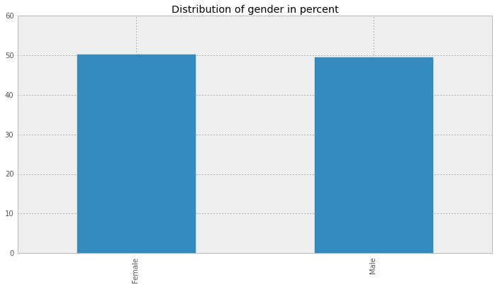

class: center, middle

# Ausgewählte Themen Sozialer Netze
Machine Learning - Kaggle EMI Competition.

---

# EMI Music Data Science Hackathon

- Vom 21. Juli 2012 bis zum 22. Juli 2012 laufender Wettbewerb auf kaggle.com der EMI Insight
- Grundlage: Datensatz der EMI Insight Marktforschung
    - Im Original über eine Million Befragungen 
    - Teildatensatz für den Hackathon

---

# Der Datensatz

### `train.csv:` 
- Künstler-Id, Track-Id, User-Id
- Abgegebene Bewertung zu einem Lied (von 1 - 100)
- Datum der Befragung
---

# Der Datensatz
- Teildatensatz enthielt __188691__ Bewertungen.
- Jeder Nutzer bewertete mehrere Titel
- Jeder Titel von mehreren Benutzern bewertet.
---

# Der Datensatz

### `users.csv`
- User-Id
- Geschlecht
- Alter
- Arbeitssituation 
- Region
---

# Der Datensatz

- Rolle von Musik im Leben des Befragten:
    - Music is important to me but not necessarily more important
    - Music means a lot to me and is a passion of mine
    - I like music but it does not feature heavily in my life
    - Music is important to me but not necessarily more important than other hobbies or interests
    - Music is no longer as important as it used to be to me
    - Music has no particular interest for me
---

# Der Datensatz

__Außerdem__ 19 Fragen, bewertet auf einer Skala von 1 - 100, wie:
- I enjoy actively searching for and discovering music that I have never heard before
- I find it easy to find new music
- I am constantly interested in and looking for more music
---

# Der Datensatz
### `words.csv`
- Künstler-Id
- User-Id
- Kennen oder besitzen die Teilnehmer Werke des Künstlers
- 82 mögliche Worte zur Beschreibung des Künstlers
---

# Der Datensatz

### Ausschnitt aus der Datei `words.csv`

---

# Zielstellung

_Wie positiv oder negativ wird eine Person ein bestimmtes neues Lied bewerten?_

Finden eines Algorithmus auf Basis der __demographischen Daten__, der abgegebenen __Bewertungen__, der __verwendeten Wörter__ und __Musikvorlieben__.

_Hinweis:_ 
Bewertung auf Grundlage deser _Root Mean Squared Error_ zwischen vorhergesagten und tatsächlichen Bewertungen der in der Datei `test.csv`. 
Diese standen uns __nicht__ zur Verfügung.
---

# Zielstellung

__Außerdem:__ Visualisierungen der Daten, beispielsweise:
- Einfluss des Alters auf den Musikgeschmack
- Einfluss der Arbeitssituation auf abgegebene Bewertungen

---

# Explorative Analyse


Die Teilnehmer bevorzugten Bewertungen in Zehnerschritten, insbesondere die Werte _10, 30, 50, 70_ und _90_.
---

# Explorative Analyse


Die Geschlechterverteilung war annähernd gleich.
---

# Explorative Analyse


Das Alter der Befragten reichte von 13 bis 94 Jahre. Die größte Bevölkerungsgruppe stellte die Gruppe der 20-25 Jährigen. 
---

# Explorative Analyse


Musik spielte für die große Mehrheit eine wichtige Rolle im Leben.
---

# Explorative Analyse

Die Zeit, die Teilnehmer täglich aktiv und passiv mit dem Hören von Musik verbringen, bewegte sich im niedrigen Bereich.
---

# Explorative Analyse

Die Aussagen über Interesse an Musik mussten in numerische Werte umgewandelt werden:

```python
  # Transform the music interest into a usable value
  def music_interest_transform(answer):
      return {
          'Music means a lot to me and is a passion of mine' : 1,
          'Music is important to me but not necessarily...' : 0.75,
          'Music is important to me but not necessarily...': 0.75,
          'I like music but it does not feature heavily...': 0.5,
          'Music is no longer as important as it used to be to me': 0.25,
          'Music has no particular interest for me': 0
      }.get(answer, np.nan)
      
  data.loc[:, 'MUSIC'] = data['MUSIC'].apply(music_interest_transform)
```
---

# Explorative Analyse


Jüngere Teilnehmer verbrachten mehr Zeit mit dem Hören von Musik als Ältere.
---

# Explorative Analyse

Das deckte sich mit dem abnehmenden Interesse an Musik im Alter.

---

# Explorative Analyse


##Zusammenhang von Teilnehmerdaten und abgegebener Bewertung

---

# Explorative Analyse

Teilnehmer, die eine feste Stelle hatten, gaben durchschnittlich am meisten Punkte, Teilnehmer die bereits pensioniert waren am wenigsten.

---

# Explorative Analyse


Das Alter hingegen gab wenig Hinweis auf die abgegebenen Bewerungen des Teilnehmers.
---

# Explorative Analyse


Niedrige Bewertungen wurden generell eher von Menschen abgegeben, die auch angaben weniger Interesse an Musik zu haben. 
---
# Definitionen

.quote[
  "REST ist eine Abstraktion der Struktur und des Verhaltens des World Wide Web" - .author[Erfinder, Roy T. Fielding]
]

.quote[
  "Restful: peaceful and quiet in a way that makes you relax" - .author[Englisches Wörterbuch]
]

---

# Motivation von REST

.quote[
  „First generation web services are like first generation Internet
  connections. They are not integrated with each other and are not
  designed so that third parties can easily integrate them in a uniform
  way.“ - .author[Paul Prescod]
]

--

Die Hauptmotivation besteht also darin WebServices zu ermöglichen, welche __einfach von dritten verwendet werden können__, so einfach, wie Webseiten verlinkt werden können.

---
class: center, middle

# __Das WWW__
Wie funktioniert das überhaupt?

---

# Client / Server .small[World Wide Web]
- Zwei autonome Systeme
- Beide haben eigene Verantwortlichkeiten (keine Überlappung)
- Kommunizieren über das HTTP Protokoll


---

# Das HTTP Protokoll .small[World Wide Web]

Wichtigste HTTP Methoden

- GET
- POST
- PUT
- DELETE
- ..

Dabei wird vom traditionellen statischen Web praktisch nur __GET__
verwendet.

---
# HTTP Request Header .small[GET hat keinen Inhalt!]
```HTTP
GET /url/pfad/?param1=value1&param2=value HTTP/1.1
Host: www.htw-berlin.de
Connection: keep-alive
Accept: text/html, … ;q=0.9,image/webp,*/*;q=0.8
User-Agent: Mozilla/5.0 (Macintosh; Intel Mac OS X 10_9_5) …
```

```HTTP
POST /url/pfad HTTP/1.1
Host: www.htw-berlin.de
Connection: keep-alive
Accept: text/html, … ;q=0.9,image/webp,*/*;q=0.8
User-Agent: Mozilla/5.0 (Macintosh; Intel Mac OS X 10_9_5) …
Content-Type: application/json
Content-Length: 36

{ param1: 'value', param2: 'value' }
```

---
# Zwischenbemerkung 

Die Aktion, welche vom Webserver durch ein HTTP Request ausgeführt wird, muss nicht immer sein, eine HTML-Seite zu generieren und zurück zu geben. Er könnte z.B auch ein Licht über ein Lichtschalter bedienen. 


---
class: middle

# Nun zurück zu REST!

---
# Representional State Transfer

Durch einen Request, wird der aktuelle Status auf der Seite des Senders in einer definierten Repräsentation (JSON, XML, HTML...) dem Empfänger an eine Methode übermittelt. 

Dieser wendet den Status, je nach Methode, auf sich selbst an. Der neue Status des Empfängers wird über den Response wieder dem Sender zurückgegeben. Somit handelt es sich also um einen Status transfer.


---
# Charakteristiken .small[REST]

- __Ressourcen__ orientierte Architektur
- Eine Ressource muss __adressierbar__ sein
- Die Adressierbarkeit der Ressourcen muss über eine __URI__ geschehen
- Eine Ressource muss eine __Repräsentation__ haben: HTML, XML, JSON...
- Abstrakte Architektur, muss nicht über HTTP gehen!

---
class: middle, center
# Was ist eine Resource?

---
# Weitere Charakteristiken .small[REST]

- Einheitliches Interface
- Statuslos
- Cachbar
- Client / Server
- Layared System
- [Code on Demand]

---
# RESTful

.quote[
"Representational state transfer (REST) is a style of software architecture. As described in a dissertation by Roy Fielding, REST is an "architectural style" that basically exploits the existing technology and protocols of the Web.

__RESTful is typically used to refer to web services implementing such an architecture.__"]

.author[http://stackoverflow.com/questions/1568834/whats-the-difference-between-rest-restful]


---
# HTTP Methoden als Einheitliches Interface .small[REST]

__GET__
Zugriff auf Ressourcen

__POST__
Ressourcen erstellen

__PUT__
Ressourcen verändern

__DELETE__
Ressourcen löschen

---

# Interface Konvention .small[RESTful]

.row[
  .pull-left[__GET__ /collection] .pull-right[Liste aller Einträge]
]
.row[
  .pull-left[__POST__ /collection] .pull-right[Erstelle neuen Eintrag]
]
.row[
  .pull-left[__GET__ /collection/:id] .pull-right[Gebe Eintrag mit der :id zurück]
]
.row[
  .pull-left[__PUT__ /collection/:id] .pull-right[Ändere Eintrag mit der :id]
]
.row[
  .pull-left[__DELETE__ /collection/:id] .pull-right[Lösche Eintrag mit der :id]
]

---
# Sicherheit .small[REST]

__GET__ methoden dürfen __NIE__ änderungen der Ressourcen hervorrufen.

__POST__, __PUT__ und __DELETE__ Methoden müssen geschützt sein (mindestens durch csrf Token)

__PUT__ und __DELETE__ müssen bei mehrerem aufrufen des gleichen Requeste immer __dasselbe Resultat__ verursachen.

---
# Die HTTP-Methode __GET__
Da die HTTP Methode GET, kein _Sender-Body_ besitzt, kann damit kein Status des Senders übermittelt werden. Sie wird deswegen ausschliesslich zur Statusabfragen von Resourcen an den Server verwendet.

_PS: URL Parameter sollten nicht als Statusräpresentation misshandelt werden._

---
# Statuslos .small[REST]

- Der gesamte Status für den Request zu bearbeiten ist im Request selbst.
- Der Server beauch keine zusätzlichen Informationen über den Status
des Clients.
- Es darf also nicht davon ausgegangen werden, dass für eine Funktionalitäet mehrere Requests in korrekter reihenfolge aufgefufen werden müssen.
- Somit ist jeder RESTful API request __Atomar__

---
# Cachbar .small[REST]

Die Repräsentation einer Resource kann gecached werden.

- Implizit = Der Client cached
- Explizit = Der Server cached die Antwort

---
# Layered System .small[REST]

Der Client weis nicht genau mit wem er kommunizieret.
Es kann z.B. Einen Load Balancer, Chachesystem usw. dazwischen sein. 

Alles was der Client wissen muss, ist die URI und die Struktur
der Repräsentation die zurück kommt.

__Dies macht die Architektur sehr scallierbar, genau wie das Web selbst.__

---
# Code on Demand

Der Server kann über die Schnittstelle Logik zum Client schicken. Im Web häuffig anzutreffen ist z.B. JavaScript. 

Im Extremfall kann eine
JavaScript _Single Page App_ einmalig über Rest vom Server geladen werden, und
diese kann dann authonom ohne Server beim Client betrieben werden.

---
# HATEOAS .small[hypermedia as the engine of application state]

- Dem Client werden in der Repräsentation Links bzw. URI's als Zustandsübergänge angeboten.
- Diese Links müssen eine URL (href), eine Beschreibung (rel) und die HTTP Methode (method) beinhalten
- Die API kann dadurch auch als eine Statemachine angesehen und Visualisiert werden.

---
# HATEOAS .small[State Machine]


---
# Beispiel .small[HATEOAS]

Repräsentation beim Anzeigen eines Eintrages der Resource "users"

```json
GET /users/5481cf60794f87511833876d 200 18.557 ms - 358
{ user: 
   { _id: '5481cf60794f87511833876d',
     name: 'Max Mustermann',
     age: 18,
     gender: 'Male',
     born_at: '2014-12-05T15:29:36.000Z',
     __v: 0 },
  links: 
   [ { method: 'PUT', href: '/users/5481cf60794f87511833876d',
       ref: 'change_user' },
     { method: 'DELETE', href: '/users/5481cf60794f87511833876d',
       ref: 'delete_user' },
     { method: 'GET', href: '/users', 
       ref: 'list_users' } ] }
```

---
# HATEOAS .small[Das Versprechen]

- URIs können nachträglich geändert werden, wenn der Client die URIs über die API verwendet.

- API sind intuitiv, da immer gesehen wird was gemacht werden kann.

- Der API Entwickler muss sich keine Gedanken über die URIs machen. Er kann sich auf die Implementation des Services konzentieren.

---
# Kritiken zu HATEOAS

HATEOAS hat ein Probleme im __WWW__ selbst. Wenn z.B. eine Resource verlinkt wurde, wird dies direkt mit der URI gemacht. Wird nun die URI verändert kommt es zu Instabilitäten.

Ein Link dazu hier https://signalvnoise.com/posts/3373-getting-hyper-about-hypermedia-apis

---
# Meine Meinung zur Debatte

- Zustandsübergänge als Links sind intuitiv.
- Die URI Struktur ist aber genau so wichtig. 
- Es sollten gängige Konventionen befolgt werden und diese sollen auf Zeit konsistent bleiben.

__APIs sollten Versionisiert werden, wenn die Struktur zu stark ändert sollte man eine neue Version erstellen und die alte parallel zur Verfügung stellen.__

---
#OAuth 2.0 Authentifikation

- Gängigstes authentifikations verfahren bei REST APIs.
- Wird von Google, Yahoo, Twitter, Facebook, ... eingesetzt.
- Wird aus einer Kombination von 3 API Calls realisiert.

- __Somit ist es nicht Statuslos und auf nicht RESTful! Aber dennoch unverzichtbar.__

---

---
class: middle, center

# ENDE

---

# Quellen .small[1]
- http://www.looah.com/source/view/2284
- https://bourgeois.me/rest/
- http://stackoverflow.com/questions/671118/what-exactly-is-restful-programming
- http://www.snet.tu-berlin.de/fileadmin/fg220/courses/WS1112/snet-project/-restful-apis_dazer.pdf

---
# Quellen .small[2]
- http://www.restapitutorial.com/
- http://www.jopera.org/files/www2008-restws-pautasso-zimmermann-leymann.pdf
- https://signalvnoise.com/posts/3373-getting-hyper-about-hypermedia-apis

