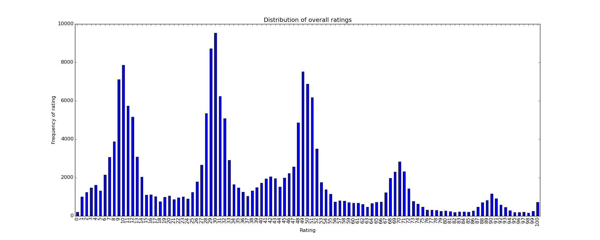
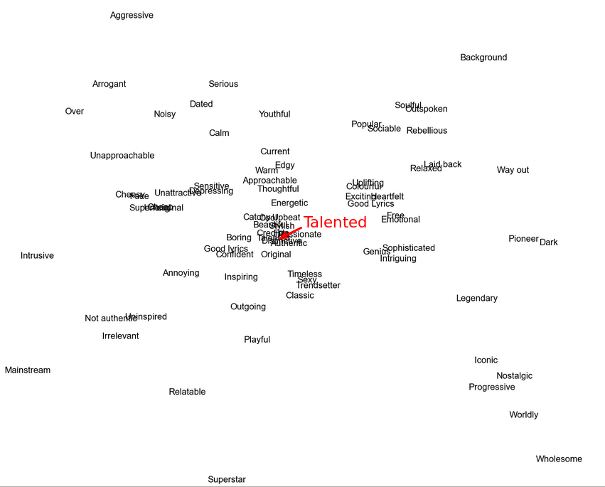
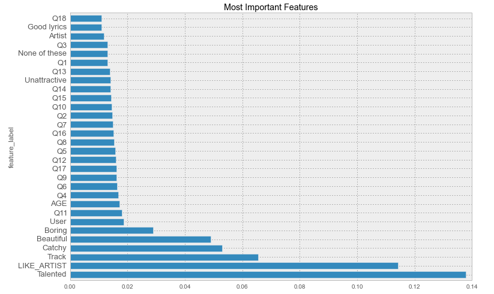
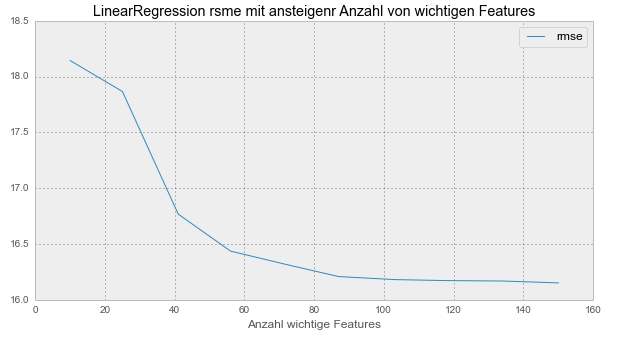

class: center, middle

# Ausgewählte Themen Sozialer Netze
Machine Learning - Kaggle EMI Competition.

---

# EMI Music Data Science Hackathon

- Vom 21. Juli 2012 bis zum 22. Juli 2012 laufender Wettbewerb auf kaggle.com der EMI Insight
- Grundlage: Datensatz der EMI Insight Marktforschung
    - Im Original über eine Million Befragungen 
    - Teildatensatz für den Hackathon

---

# Der Datensatz

### `train.csv:` 
- Künstler-Id, Track-Id, User-Id
- Abgegebene Bewertung zu einem Lied (von 1 - 100)
- Datum der Befragung
---

# Der Datensatz
- Teildatensatz enthielt __188691__ Bewertungen.
- Jeder Nutzer bewertete mehrere Titel
- Jeder Titel von mehreren Benutzern bewertet.
---

# Der Datensatz

### `users.csv`
- User-Id
- Geschlecht
- Alter
- Arbeitssituation 
- Region
---

# Der Datensatz

- Rolle von Musik im Leben des Befragten:
    - Music is important to me but not necessarily more important
    - Music means a lot to me and is a passion of mine
    - I like music but it does not feature heavily in my life
    - Music is important to me but not necessarily more important than other hobbies or interests
    - Music is no longer as important as it used to be to me
    - Music has no particular interest for me
---

# Der Datensatz

__Außerdem__ 19 Fragen, bewertet auf einer Skala von 1 - 100, wie:
- I enjoy actively searching for and discovering music that I have never heard before
- I find it easy to find new music
- I am constantly interested in and looking for more music
---

# Der Datensatz
### `words.csv`
- Künstler-Id
- User-Id
- Kennen oder besitzen die Teilnehmer Werke des Künstlers
- 82 mögliche Worte zur Beschreibung des Künstlers
---

# Der Datensatz

### Ausschnitt aus der Datei `words.csv`

---

# Zielstellung

_Wie positiv oder negativ wird eine Person ein bestimmtes neues Lied bewerten?_

Finden eines Algorithmus auf Basis der __demographischen Daten__, der abgegebenen __Bewertungen__, der __verwendeten Wörter__ und __Musikvorlieben__.

_Hinweis:_ 
Bewertung auf Grundlage deser _Root Mean Squared Error_ zwischen vorhergesagten und tatsächlichen Bewertungen der in der Datei `test.csv`. 
Diese standen uns __nicht__ zur Verfügung.
---

# Zielstellung

__Außerdem:__ Visualisierungen der Daten, beispielsweise:
- Einfluss des Alters auf den Musikgeschmack
- Einfluss der Arbeitssituation auf abgegebene Bewertungen

---

# Explorative Analyse


Die Teilnehmer bevorzugten Bewertungen in Zehnerschritten, insbesondere die Werte _10, 30, 50, 70_ und _90_.
---

# Explorative Analyse


Die Geschlechterverteilung war annähernd gleich.
---

# Explorative Analyse


Das Alter der Befragten reichte von 13 bis 94 Jahre. Die größte Bevölkerungsgruppe stellte die Gruppe der 20-25 Jährigen. 
---

# Explorative Analyse


Musik spielte für die große Mehrheit eine wichtige Rolle im Leben.
---

# Explorative Analyse

Die Zeit, die Teilnehmer täglich aktiv und passiv mit dem Hören von Musik verbringen, bewegte sich im niedrigen Bereich.
---

# Explorative Analyse

Die Aussagen über Interesse an Musik mussten in numerische Werte umgewandelt werden:

```python
  # Transform the music interest into a usable value
  def music_interest_transform(answer):
      return {
          'Music means a lot to me and is a passion of mine' : 1,
          'Music is important to me but not necessarily...' : 0.75,
          'Music is important to me but not necessarily...': 0.75,
          'I like music but it does not feature heavily...': 0.5,
          'Music is no longer as important as it used to be to me': 0.25,
          'Music has no particular interest for me': 0
      }.get(answer, np.nan)
      
  data.loc[:, 'MUSIC'] = data['MUSIC'].apply(music_interest_transform)
```
---

# Explorative Analyse


Jüngere Teilnehmer verbrachten mehr Zeit mit dem Hören von Musik als Ältere.
---

# Explorative Analyse

Das deckte sich mit dem abnehmenden Interesse an Musik im Alter.

---

# Explorative Analyse


##Zusammenhang von Teilnehmerdaten und abgegebener Bewertung

---

# Explorative Analyse

Teilnehmer, die eine feste Stelle hatten, gaben durchschnittlich am meisten Punkte, Teilnehmer die bereits pensioniert waren am wenigsten.

---

# Explorative Analyse


Das Alter hingegen gab wenig Hinweis auf die abgegebenen Bewerungen des Teilnehmers.
---

# Explorative Analyse


Niedrige Bewertungen wurden generell eher von Menschen abgegeben, die auch angaben weniger Interesse an Musik zu haben. 

---

# Kookkurentsanalyse

```json
  {
      'Aggressive': {
          'Annoying': 337,
          'Approachable': 145,
          'Arrogant': 1539,
          'Authentic': 515,
          ...
       },
       'Annoying': {
          'Aggressive': 337,
          'Approachable': 18,
          'Arrogant': 372,
          'Authentic': 50,
          ...
       },
       ...
  }
```

---
# Wörter und ihre Verbindung



---
# None Of These


---
# 30 signifikantesten Kookkurenten


---
# Dummy-Werte/Spalten erstellen

- Gender { Male, Female }
- Region { North west, South ... }
- Working { Fulltime, ... }
- MUSIK
- HEARD_OF
- OWN_ARTIST_MUSIC

---
# LIST_OWN und LIST_BACK

Nummerische Werte nummerisch und verbal dargestellt.

- Less than an hour
- More than 16 Hours
- 1 hour

---

# LineareRegression

- Crossvalidation Durchschnitt
- 3 Iterationen
- NaN-Werte auf Mittelwert

## rmse => 16.15075547663826
## Kaggle Gewinner => 13.19638

---

# RidgeRegressor -> Regularisation


---

# Lasso

- Regularisation durch aussortieren schlechter Features
- alpha zwischen 0.001 und 0.5

## rmse stetig => 16.15__09__47926890396
## LR rmse => 16.15__07__5547663826

---

# RandomForest

- N zufällige Entscheidungsbäume
- N auf 100 gesetzt.

## rmse => 14.568395227441838
## LR rmse => 16.15__07__5547663826
## Kaggle Gewinner => 13.19638

---

# Wichtige Features RandomForest

- __Talented__ mit Abstand am Besten



---

# Alle wichtigen Features sortiert

- Erstes Drittel am wichtigsten.


---

# LineareRegression mit wichtigsten Features



---

# PCA und LineareRegression


---

# Support Vector Regression

- 5 Stunden Rechenzeit
- Standardeinstellungen
- Evt bessere hyperparameter, jedoch super Zeitintensiv.

## rmse => 22.2378

---

# Underfitting und nicht Overfitting

- Es wurden mit weniger Features __nie__ bessere Resultate erzielt.
- Verdacht auf Underfitting
- Versuchen mehr Features zu generieren

---

# Altersgruppen

- 10 Jahres Abschnitte 
- RandomForest und LineareRegression besser geworden

## LR (neu/alt) => (16.14 / 16.15)
## RF (neu/alt) => (14.562 / 14.568)

---

# RMSE auf Testdaten

- LinearRegression mit AGE Gruppierung: 
  - rmse: __16.219554709616276__
  - Kaggle Platzierung: __58__

- RandomForest mit AGE Gruppierung: 
  - rmse = __14.376954514210322__
  - Kaggle Platzierung: __23__

---

# Ausblick

- Wieteres Feature-Engeneering
  - Analysieren der besten Fragen
  - Clustering der Kookkurenten

- Collaborative Filtering
  - Rating durch Ratings von ähnlichen Benutzern, Tracks und Artists.

---

# Fazit

- Hohe Rechenleistung / Zeit.
- Blackbox Gefühl
  - Erfahrung muss gesammelt werden
  - Verstehen der Algorithmen extrem wichtig
- Interdisziplinärer 
